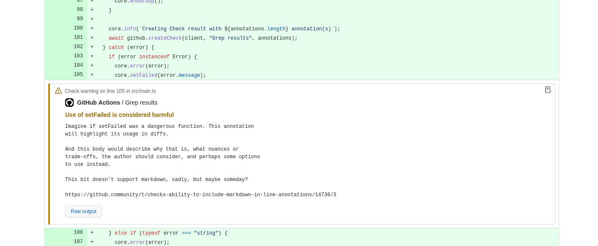

# Grep Action

Run `grep` and report results, along with additional context, as annotations.

## Motivation

This is a shameless copy of Code Climate's [`grep` engine][grep-engine]
([license][grep-license]), implementing the same functionality as a GitHub
Action.

[grep-engine]: https://docs.codeclimate.com/docs/grep
[grep-license]: https://github.com/codeclimate/codeclimate-grep/blob/master/LICENSE

The `grep` engine is a low-friction way to introduce automated, timely, and
_useful_ feedback on any piece of incoming code you can target with a regular
expression.

We wanted it as a GitHub Action to gain:

- Performance of running over only the changed files in the PR
- Convenience of annotations appearing in the diff (without a Browser Extension)

Note that if you're considering using this Action over Code Climate, you will
lose:

- Markdown support in the annotation content (until GitHub implements it)
- Tracking extant Issues over time and centralizing them with other Code Climate
  analyses

## Usage

```yaml
on:
  pull_request:

jobs:
  grep:
    runs-on: ubuntu-latest
    steps:
      - uses: freckle/grep-action@v1
        with:
          patterns: |
            - pattern: "\\bword\\b"

              syntax: extended

              binary-files: without-match

              paths:
                - "**/*"

              paths-ignore:
                - "test/**/*"

              level: warning

              title: A brief title

              message: |
                A longer message body
```

## Inputs

- `patterns`: See below.

- `only-changed`: If `true` (the default), only the files changed in the Pull
  Request will be considered.

  **NOTE**: This action doesn't really work on non-`pull_request` events.

- `create-new-check`: If `true`, a new Check is created and the annotations are
  attached to it. Default is `false`, which means to log the annotations
  normally.

- `failure-threshold`: If any annotations are created at or above this level,
  the run will fail. See `patterns[].level` for valid values. Default is
  `failure`.

- `github-token`: override the default `GITHUB_TOKEN`, if desired.

See [`./action.yml`](./action.yml) for complete details.

## The `patterns` Input

The `patterns` input is a String (as all inputs must be) that contains a Yaml
Array of Objects with the following keys:

- `id`

  An optional identifier for the pattern. If provided, we will set outputs for
  it (see below).

- `pattern`

  A `grep` "Basic Regular Expression". See the "Basic vs Extended Regular
  Expressions" section of [`grep(1)`][man-grep] for more details. **Required**.

  [man-grep]: https://linux.die.net/man/1/grep

- `syntax`

  The `grep` "Pattern Syntax" to use. This corresponds to `grep`'s `-E`, `F`,
  `-G`, or `-P` options. One of `extended`, `fixed`, `basic`, or `perl`. Default
  is `basic` (like `grep` itself).

- `binary-files`

  Controls searching in binary files, corresponding to `grep`'s
  `--binary-files=<value>` option. One of `binary` (search binary files but do
  not print), `without-match` (do not search binary files), or `text` (treat
  all files as text). Default is `binary` (like `grep` itself).

- `paths`

  List of globs, files matching any will be `grep`ped. Default is everything
  (`["**/*"]`).

- `paths-ignore`

  List of globs, files matching `paths` but that match any of these will **not**
  be `grep`ped. Default is none (`[]`).

- `level`

  The level of the resulting annotation, `notice|warning|failure`. Default is
  `notice`.

- `title`

  A short title for the annotation resulting from this pattern. **Required**.

- `message`

  A longer message for the annotation resulting from this pattern. Default is
  none.

## Outputs

For any patterns with an `id` specified, the following outputs will be set:

- `{id}`: the string `'true'` if any matches were found, or `'false'` if not.
- `{id}_count`: the number of matches found.
- `{id}_results`: a JSON-encoded list of objects with the following properties:

  - `input`: the full line of `grep -n` output
  - `path`: the matched path, parsed from above
  - `line`: the line number of the match, parsed from above

## Example



## Release

To trigger a release (and update the `@v{major}` tag), merge a commit to `main`
that follows [Conventional Commits][]. In short,

- `fix:` to trigger a patch release,
- `feat:` for minor, and
- `feat!:` and major

We don't enforce conventional commits generally (though you are free do so),
it's only required if you want to trigger release.

[conventional commits]: https://www.conventionalcommits.org/en/v1.0.0/#summary

---

[LICENSE](./LICENSE)
